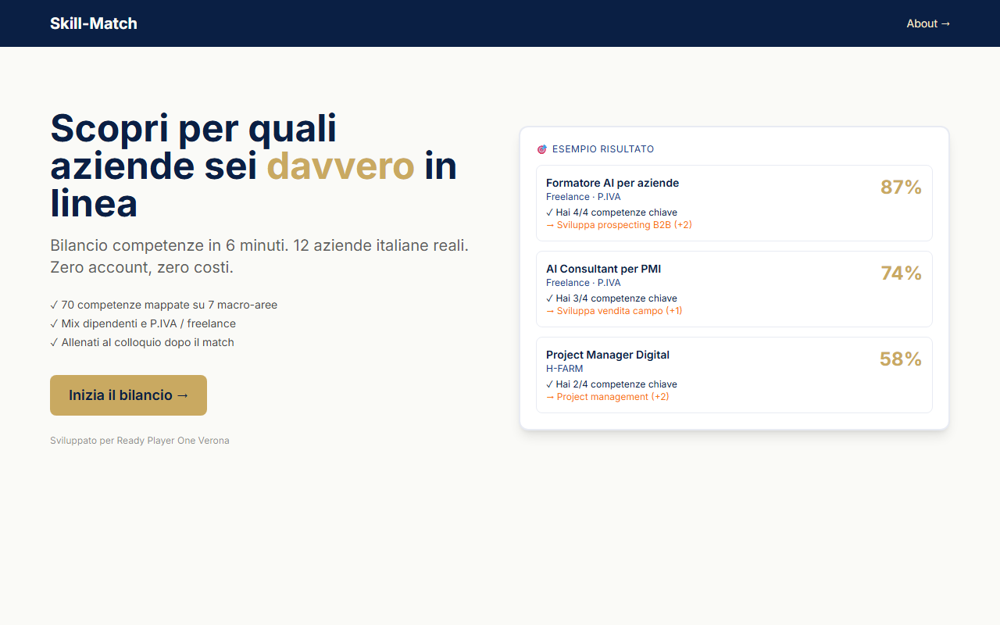

<div align="center">

# Skill-Match

**Bilancio competenze + coach vocale per il colloquio. 100% nel browser — zero backend, zero account, zero API key.**

[](https://skill-match-tan.vercel.app)
[](https://react.dev)
[](https://www.typescriptlang.org)
[](https://vitejs.dev)
[](LICENSE)

### 🚀 [Prova la demo live →](https://skill-match-tan.vercel.app)



</div>

---

## Cosa fa

Skill-Match porta un candidato dal *"non so bene cosa so fare"* a *"ecco le 3 posizioni a cui posso candidarmi, e mi sono già allenato per il colloquio"* — in meno di 15 minuti, tutto nel browser.

1. **Bilancio competenze** — questionario adattivo (14 schermate, ~6 minuti) che mappa 70 competenze su 7 macro-aree
2. **Matching trasparente** — top-3 ruoli su 12 posizioni del mercato italiano reale (8 da dipendente, 4 in P.IVA), con percentuale di match, *perché* matchi e *quali gap* colmare
3. **Coach vocale** — simulazione colloquio per il ruolo scelto: l'app fa le domande a voce (TTS), tu rispondi parlando (STT), e a fine sessione ricevi una scorecard su 5 metriche

## Perché 100% client-side

È una scelta progettuale, non una limitazione:

- **Privacy by design** — la voce dell'utente non lascia mai il browser: il riconoscimento vocale usa la Web Speech API nativa
- **Zero costi di esercizio** — nessun backend, nessuna API key, nessun database: il deploy è un sito statico
- **Funziona subito** — niente registrazione, niente onboarding: si clicca e si inizia

## Stack

| Livello | Tecnologia |
|---|---|
| UI | React 18 + TypeScript 5 |
| Build | Vite 5 |
| Stile | Tailwind CSS 3 (palette navy/gold) |
| Routing | React Router 6 |
| Voce | Web Speech API (SpeechSynthesis + SpeechRecognition) |
| Test | Vitest — 32 unit test su engine di matching, scoring del coach e gestione voce |
| Deploy | Vercel (statico) |

## Architettura

```
src/
├── data/            # contenuti separati dalla logica
│   ├── skills.json          # 7 macro-aree, ~70 tag competenza
│   ├── jobs.json            # 12 ruoli reali del mercato italiano
│   ├── questions.json       # 14 schermate del questionario adattivo
│   └── coach_questions.json # 72 domande colloquio (6 per ruolo)
├── engine/          # matching: scoring vettoriale + narrative dei gap
├── coach/           # sessione vocale: wrapper Web Speech API,
│                    # state machine, scoring deterministico 5 metriche
├── components/      # UI per modulo (wizard / results / coach / ui)
├── pages/           # Landing → Wizard → Results → Coach → Scorecard
└── hooks/           # useWizard, useMatch
```

I due moduli (matching e coach) sono indipendenti: dati in JSON, logica negli engine testati, UI separata. Aggiungere un ruolo o una domanda non richiede di toccare il codice.

## Avvio locale

```bash
npm install
npm run dev        # http://localhost:5173
```

```bash
npm run test       # 32 unit test (Vitest)
npm run build      # build di produzione in dist/
npm run preview    # serve la build su http://localhost:4173
```

## Compatibilità voce

| Browser | TTS + STT |
|---|---|
| Chrome / Edge desktop | ✅ completo |
| Chrome Android | ✅ completo |
| Safari iOS 15+ | ✅ completo |
| Firefox | ✍️ fallback automatico: si risponde scrivendo |

## Stato del progetto

**Prototipo funzionante, in evoluzione.** Costruito come progetto di apprendimento con sviluppo AI-assistito (Claude Code), con l'obiettivo di imparare l'intero ciclo: spec → piano → TDD → deploy.

Cosa funziona oggi: flusso completo bilancio → match → coach vocale → scorecard, testabile nella [demo live](https://skill-match-tan.vercel.app).

Limiti noti e roadmap:

- [ ] Lo scoring del coach è deterministico (metriche su lunghezza, struttura, parole chiave) — la valutazione semantica delle risposte via LLM è studiata ma non implementata
- [ ] La qualità del TTS dipende dalle voci di sistema del browser
- [ ] Le 12 posizioni sono un dataset curato a mano — manca un'integrazione con fonti esterne
- [ ] UX audio migliorabile (gestione pause, interruzioni, rumore di fondo)

## Autore

**Francesco Guerra** — Verona
Marketing automation & CRM (7+ anni) · AI-assisted development

[LinkedIn](https://www.linkedin.com/in/frank-war-85) · [GitHub](https://github.com/frank-85) · francesco.war85@gmail.com

---

<div align="center">
<sub>Rilasciato sotto licenza <a href="LICENSE">MIT</a></sub>
</div>
